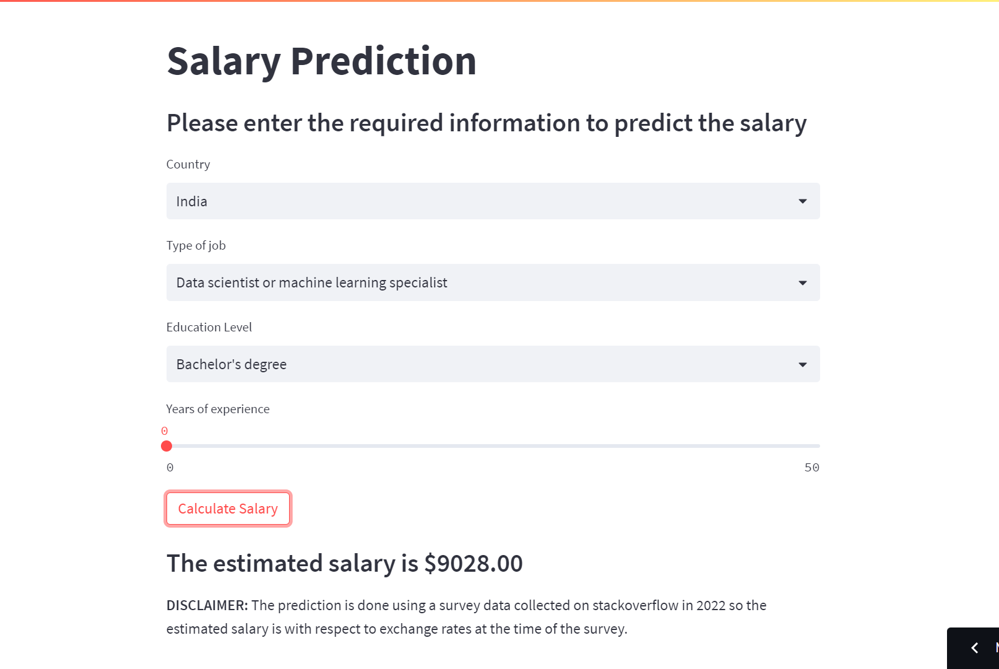

# Salary-prediction

Dataset: https://insights.stackoverflow.com/survey

This is a regression problem, in which I've used some features from the data collected by Stackoverflow in their Annual Developer Survey.

The features selected are:

- Country
- Developer types
- Education level
- Employment types
- Annual Compensation converted into USD

The web app is deployed at https://loyumm-salary-prediction-app-05tfgq.streamlit.app/

## Screenshot of webapp

## To run it locally:

The app is deployed on streamlit cloud and will be deployed using other platforms later. However, it is also available for offline run.
To do so, open terminal and do the followig steps:

#### Clone the repo

`git clone 'https://github.com/LoyumM/salary-prediction.git'`

#### Create a virtual environment

`conda create -p venv python == 3.9 -y`

#### Activate environment

`conda activate venv/`

#### Install the required modules

`pip install -r requirements.txt`

#### Run the application

`streamlit run app.py`
